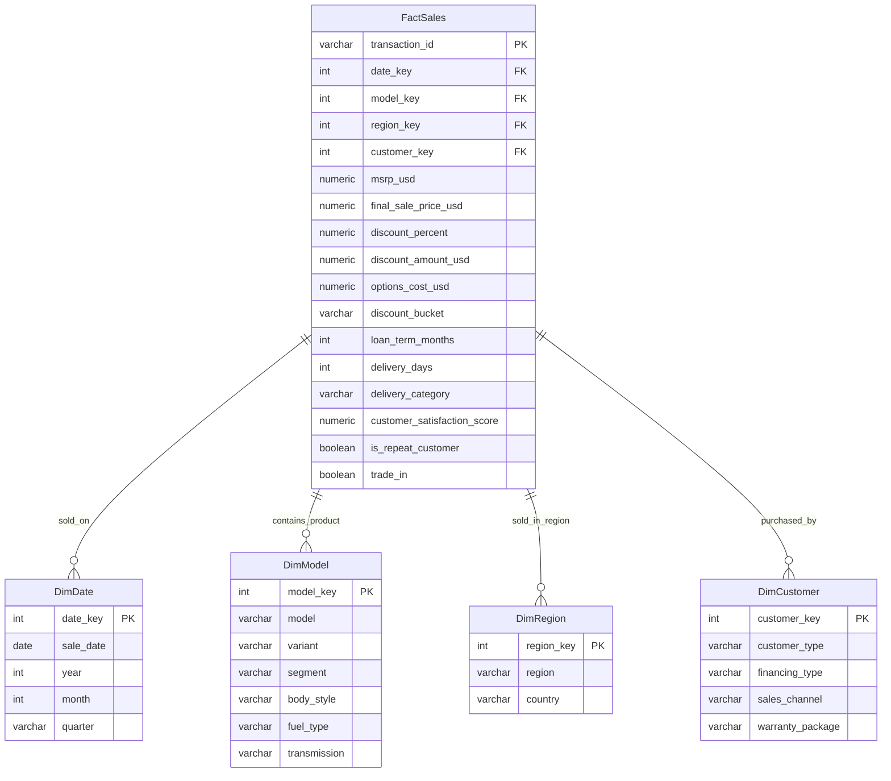
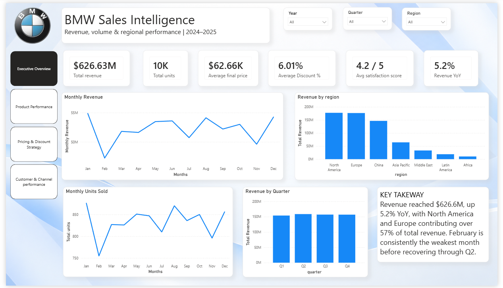
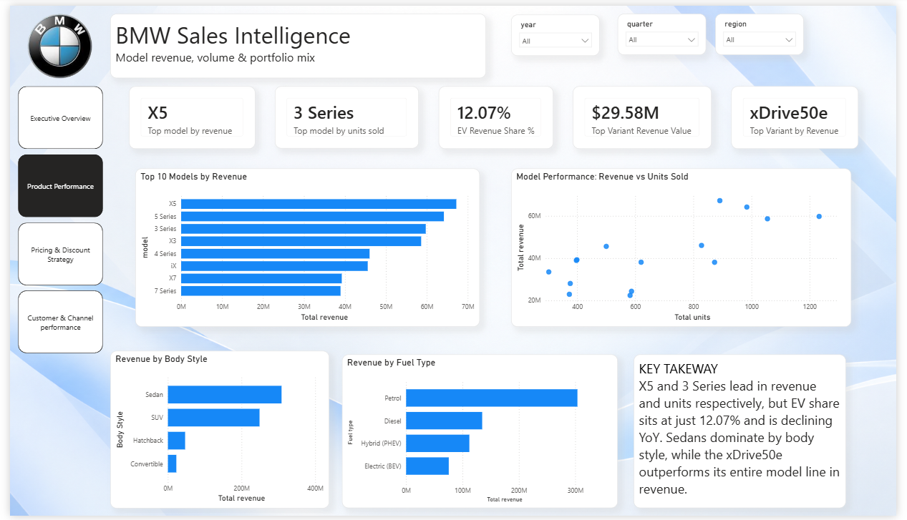
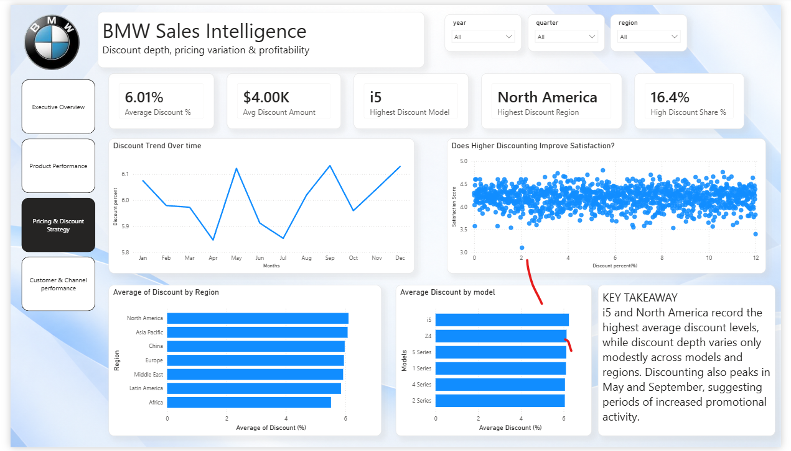
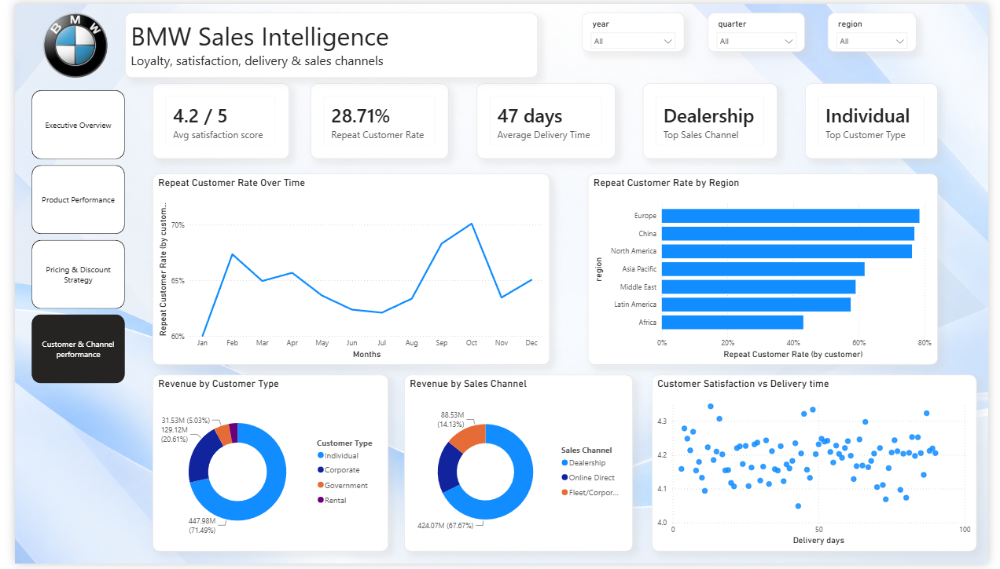

# BMW Sales Intelligence & Pricing Analytics (2024–2025)

## 1. Project Overview

An end-to-end business intelligence project analyzing 10,000 BMW sales transactions (2024–2025). The workflow covers data cleaning and EDA in Python, a PostgreSQL star schema, SQL-based analysis, and a 4-page Power BI dashboard built around specific business questions rather than generic charts.

The dashboard covers four lenses: **executive performance, product performance, pricing & discount strategy, and customer & channel performance** — each page answers a distinct question, and together they form one narrative: revenue is growing, but that growth is increasingly discount-supported and coming from a shrinking EV mix, so the customer layer checks whether loyalty is strong enough underneath to sustain it.

---

## 2. Business Problem & Objective

BMW leadership needs a fast, reliable view of sales performance across four areas:

- Which models, body styles, and fuel types drive revenue and volume?
- Where is revenue concentrated, and how is it trending?
- Is discounting concentrated in specific models/regions, and is it buying customer satisfaction?
- How do delivery time, loyalty, and sales channel relate to customer experience?

**Objective:** turn raw transaction data into a validated data model, SQL-based analysis, and an executive-facing Power BI dashboard that supports decisions on pricing, product mix, and customer retention.

---

## 3. Tech Stack

- **Data cleaning:** Python 3, Pandas, NumPy
- **Database:** PostgreSQL (star schema)
- **EDA:** Jupyter Notebooks, Matplotlib/Seaborn
- **BI & analysis:** SQL (CTEs, window functions), Power BI (DAX, star schema modeling)
- **Version control:** Git & GitHub

---

## 4. Dataset Overview

10,000 sales transactions across 7 regions and 14+ BMW models.

- **Dimensions:** sale date/year/quarter/month, model/variant/body style/fuel type/transmission, region/country, customer type/financing type/sales channel
- **Metrics:** MSRP, discount %, discount amount, final sale price, options cost, delivery days, customer satisfaction score

---

## 5. Data Cleaning & Validation

- Verified zero duplicate transaction IDs and internal date consistency (year/month/quarter alignment)
- Validated pricing columns (`final_sale_price_usd`, `msrp_usd`) are positive; `discount_percent` within a logical 0–100% range
- **Missing values handled by business meaning, not blanket imputation:**
  - `customer_satisfaction_score` left `NULL` for non-respondents (~24% of rows) rather than imputed, to avoid manufacturing fake sentiment
  - `loan_term_months` left `NULL` where financing wasn't applicable

---

## 6. Feature Engineering

- `discount_bucket` — sales classified into discount depth tiers (Low / Medium / High) to analyze pricing pressure
- `delivery_category` — Fast / Normal / Delayed, to isolate fulfillment performance (data showed a strong skew toward "Delayed," which shaped how this metric was visualized)
- `year_month` — clean chronological key for trend charts

**Note:** an initial `profit_proxy` feature was engineered but later dropped from the final dashboard — the project didn't have true manufacturing cost data, and a directional-but-unverifiable margin figure was judged more likely to mislead than inform. See Section 11.

---

## 7. Data Warehousing & Star Schema



---

## 8. SQL Analysis

Analytical queries against the PostgreSQL star schema, grouped into five business themes: Revenue, Pricing & Discount, Regional Performance, Product Performance, and Customer & Sales Channel. Techniques used include window functions (regional contribution %, model ranking), CTEs with `LAG()` for MoM/YoY growth, and boolean casting for repeat-purchase rate calculations.

*(Fill in your actual query count and file names here — keep this section only as detailed as what's actually in your `/sql` folder.)*

---

## 9. Power BI Dashboard

Four pages, each built around one business question, sharing a consistent visual system (BMW blue accent, white cards, consistent KPI formatting, and a written key-takeaway on every page).

### 9.1 Executive Overview
**Question:** How is BMW performing overall, and where is revenue coming from?
**KPIs:** Total Revenue · Total Units · Avg Final Price · Avg Discount % · Avg Satisfaction · Revenue YoY %
**Visuals:** Monthly Revenue · Revenue by Region · Monthly Units Sold · Revenue by Quarter



### 9.2 Product Performance
**Question:** Which models and product categories drive revenue and volume?
**KPIs:** Top Model by Revenue · Top Model by Units · EV Revenue Share % · Top Variant Revenue Value · Top Variant by Revenue
**Visuals:** Top 10 Models by Revenue · Model Performance (Revenue vs Units scatter) · Revenue by Body Style · Revenue by Fuel Type



### 9.3 Pricing & Discount Strategy
**Question:** Where is discounting concentrated, and does it correlate with satisfaction?
**KPIs:** Avg Discount % · Avg Discount Amount · Highest Discount Model · Highest Discount Region · High Discount Share %
**Visuals:** Discount Trend Over Time · Discount vs Satisfaction (scatter) · Avg Discount by Region · Avg Discount by Model



### 9.4 Customer & Channel Performance
**Question:** How do loyalty, satisfaction, delivery time, and channel relate to performance?
**KPIs:** Avg Satisfaction · Repeat Customer Rate · Avg Delivery Time · Top Sales Channel · Top Customer Type
**Visuals:** Repeat Customer Rate Over Time · Repeat Customer Rate by Region · Revenue by Customer Type · Revenue by Sales Channel · Satisfaction vs Delivery Time (scatter)



---

## 10. Key Business Insights

**Revenue & Regional**
- Total revenue reached **$626.6M**, up **5.2% YoY**
- North America and Europe together contribute **over 57%** of total revenue
- February is consistently the weakest month before recovering through Q2

**Product**
- **X5** leads by revenue; **3 Series** leads by units — revenue and volume leaders are different models
- **EV revenue share is 12.07%** and declining YoY, despite strong performance from conventional top sellers
- Sedans dominate by body style; the **xDrive50e** variant outperforms its entire model line in revenue

**Pricing & Discounting**
- Overall average discount is **6.01%**
- **i5** carries the highest average discount at the model level; **North America** at the regional level
- **16.4%** of sales fall into the high-discount bucket
- Discount depth shows a **weak relationship** with customer satisfaction — deeper discounts aren't clearly buying more loyalty (association, not causation)

**Customer & Channel**
- **28.71% repeat customer rate**, calculated at the true customer level (distinct `customer_key`), not per-transaction
- Average delivery time is **~47 days**
- **Dealership** is the leading sales channel; **Individual** buyers drive the largest revenue share

---

## 11. Data Quality Decisions

**`segment` column dropped.** The field contained internally inconsistent values — an "EV" category that, on inspection, was mostly non-electric vehicles by fuel type (majority Petrol/Diesel/Hybrid, not BEV). Since EV describes a powertrain, not a market segment, this column couldn't be trusted for classification. `body_style` and `fuel_type` were used instead, and the decision was documented rather than silently correcting or dropping the anomaly.

**`profit_proxy` dropped.** Without real manufacturing cost data, this derived margin figure was directional at best and risked being read as a real profitability number. Removed from the final dashboard rather than presented with a misleading label.

**Repeat customer rate** is calculated using `DISTINCTCOUNT` on `customer_key`, filtered by `is_repeat_customer`, rather than counting flagged transaction rows — this avoids inflating the rate when a single loyal customer has multiple purchases.

---

## 12. Folder Structure

```text
BMW_Sales_Analysis/
├── README.md
├── Dataset/
│   ├── raw/
│   └── clean/
├── Notebooks/
│   ├── 01_data_cleaning.ipynb
│   └── 02_eda.ipynb
├── Scripts/
│   └── load_to_postgres.py
├── sql/
│   ├── revenue_analysis.sql
│   ├── pricing_and_discount_analysis.sql
│   ├── product_performance_analysis.sql
│   ├── regional_performance_analysis.sql
│   └── customer_sales_channel_analysis.sql
├── powerbi/
│   └── bmw_sales_intelligence.pbix
└── images/
    └── dashboard/
        ├── Executive_Overview.png
        ├── Product_Performance.png
        ├── Pricing_and_Discount_strategy.png
        └── Customer_and_Channel_performance.png
```

---

## 13. Future Improvements

- Automate the ETL step (e.g., Airflow DAG) instead of a manual load script
- Add real manufacturing cost data to enable true profit/margin analysis
- Predictive model for delivery delay risk based on region and channel
- Extend customer analysis with cohort/RFM segmentation
