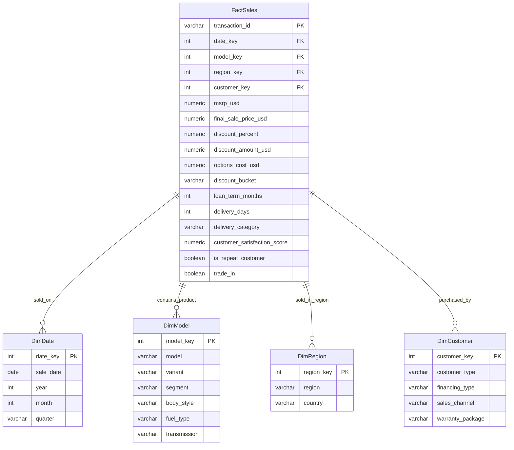

# BMW Sales Intelligence & Pricing Analytics (2024–2025)

## 1. Project Overview
This project is an end-to-end business intelligence and data analytics solution designed to analyze global BMW sales transactions from 2024 to 2025. It integrates data cleaning and exploratory data analysis (EDA) in Python, structural database design (PostgreSQL Star Schema), and advanced SQL analysis to deliver actionable business insights. The project concludes with a planned 4-page interactive Power BI dashboard designed to empower executive decisions.

---

## 2. Business Problem & Objective
**Core Business Problem:**
BMW executive leadership needs to monitor sales performance, evaluate regional profitability, assess the health of the pricing and discounting strategy, and optimize logistics. Specifically, the business is trying to answer:
* *Which models, segments, and sales channels drive profitable growth?*
* *Is the current discounting strategy driving incremental sales volume or eroding margins?*
* *How are fulfillment timelines affecting customer satisfaction (CSAT)?*
* *Are EV models gaining revenue share compared to conventional models?*

**Business Objective:**
To build a comprehensive data platform and Business Intelligence dashboard that helps BMW executives monitor sales performance, customer loyalty, pricing elasticity, and regional profitability, enabling data-driven inventory allocation and discount optimization.

---

## 3. Tech Stack
* **Data Engineering & Cleaning:** Python 3, Pandas, NumPy, SQLAlchemy
* **Database & ETL:** PostgreSQL 16 (Star Schema modeling)
* **Data Analysis & Viz:** Python (Jupyter Notebooks, Matplotlib, Seaborn)
* **Business Intelligence & Reporting:** SQL (Advanced CTEs, Window Functions), Power BI (DAX, Star Schema Data Modeling)
* **Version Control:** Git & GitHub

---

## 4. Dataset Overview
The dataset contains **10,000 sales transactions** from 2024 to 2025 across 7 regions and 14 BMW models, featuring 30 raw variables:
* **Dimensions:** Time (Sale Date, Year, Quarter, Month), Product (Model, Variant, Segment, Body Style, Fuel Type, Transmission), Geography (Region, Country), Customer Profile (Customer Type, Financing Type, Sales Channel, Loyalty, Warranty).
* **Metrics:** MSRP, Discount Percent, Discount Amount, Final Sale Price, Options Cost, Delivery Days, Customer Satisfaction Score (CSAT).

---

## 5. Data Cleaning & Structural Validation
The raw dataset was cleaned and structured in Python using the following business-critical rules:
1. **Structural Validation:** Verified that there are 0 duplicate transaction IDs and that all dates are internally consistent with their respective year, month, and quarter fields.
2. **Business Rule Validation:** Confirmed that pricing columns (`final_sale_price_usd`, `msrp_usd`) are positive (> 0) and that `discount_percent` is restricted to the logical range of 0–100%.
3. **Missing Value Management:**
   * `loan_term_months`: Left as `NULL` for Cash/Subscription customers to prevent creating artificial loans.
   * `customer_satisfaction_score`: Left as `NULL` for non-respondents to prevent survey response bias.

---

## 6. Feature Engineering
Four strategic features were engineered in Python before database ingestion:
* `profit_proxy` = `final_sale_price_usd` - `msrp_usd` + `discount_amount_usd` (Directional margin indicator per sale).
* `discount_bucket` = Classified into `Low (0-5%)`, `Medium (5-10%)`, `High (10-20%)`, and `Very High (20%+)` to evaluate price elasticity.
* `year_month` = Formatted period key for clean chronological trends.
* `delivery_category` = Classified into `Fast (<7 days)`, `Normal (7-14 days)`, and `Delayed (>14 days)` to isolate supply chain performance.

---

## 7. Data Warehousing & Star Schema
The cleaned data was normalized into a **Star Schema** to optimize query performance and enable clean, fast relationship modeling in Power BI.



---

## 8. Advanced SQL Analysis
A suite of 22 analytical queries was built to extract insights from the PostgreSQL star schema. They leverage:
* **Window Functions:** Slicing regional contribution percentages, performing running totals, and ranking models.
* **CTEs & Window LAG:** Computing Month-over-Month (MoM) and Year-over-Year (YoY) growth rates.
* **Casting & Boolean Averaging:** Calculating repeat purchase rates.

The 22 queries are grouped into five business themes:

* Revenue Analysis
* Pricing & Discount Analysis
* Regional Performance Analysis
* Product Performance Analysis
* Customer & Sales Channel Analysis

---

## 9. Key Business Insights
1. **Sales Stability:** Monthly revenue remains highly stable (averaging **0.92% MoM growth**), indicating healthy demand consistency.
2. **Regional Growth:** **North America** and **Europe** drive **56.4%** of global revenue. However, the **Asia Pacific** region is the fastest grower, registering **8.60% YoY growth** between 2024 and 2025.
3. **Volume vs. Value Drivers:** The **3 Series** is the highest volume vehicle (**1,233 units**), whereas the **X5** is the top revenue generator, contributing **$67.20M** to the business.
4. **Discounting Elasticity:** Discounting has almost zero linear correlation with customer satisfaction ($r = 0.004$). Slicing by `discount_bucket` reveals that deeper discounts do not lead to proportional sales volume increases, indicating potential margin leakage in high-discount regions (like North America at 6.11%).
5. **EV Transition Headwinds:** Revenue share of the EV lineup (i4, i5, i7, iX) contracted slightly from **23.68%** in 2024 to **22.67%** in 2025.
6. **Logistics & CSAT:** Fast delivery times (<7 days) yield a higher average CSAT (**4.23**) compared to delayed deliveries (**4.19**).

---

## 10. Power BI Dashboard Plan
The dashboard design is documented in [powerbi_dashboard_plan.md](powerbi_dashboard_plan.md). It defines the four report pages, shared slicers, DAX measures, drillthrough behavior, and visual layout recommendations needed to turn the analysis into an executive-facing BI report.

---

## 11. Folder Structure
```
BMW_Sales_Analysis/
├── README.md               # Main project documentation
├── powerbi_dashboard_plan.md # Power BI dashboard design blueprint
├── .env                    # Local environment config (credentials)
├── data_quality_report.md  # Data cleaning and validation summary
├── eda_summary.md          # Key findings from Python EDA
├── insights_summary.md     # Detailed business insights summary
├── Dataset/
│   ├── raw/                # Contains original transaction files
│   └── clean/              # Contains the cleaned dataset (bmw_cleaned.csv)
├── Notebooks/
│   ├── 01_data_cleaning.ipynb # Jupyter notebook for Pandas data cleaning
│   └── 02_eda.ipynb           # Jupyter notebook for Seaborn/Matplotlib analysis
├── Scripts/
│   └── load_to_postgres.py    # Python pipeline to build schema and load PostgreSQL
├── sql/
│   ├── revenue_analysis.sql
│   ├── pricing_and_discount_analysis.sql
│   ├── product_performance_analysis.sql
│   ├── regional_performance_analysis.sql
│   └── customer_sales_channel_analysis.sql
├── powerbi/
│   └── (Pending .pbix file development)
└── images/
    └── eda/                # Saved EDA visual files (.png)
```

---

## 12. Future Improvements
* **Automate ETL:** Transition the SQL load script into an Airflow DAG.
* **Incorporate Cost Data:** Add vehicle manufacturing cost data to enable true net-profit analysis instead of using `profit_proxy`.
* **Predictive Analytics:** Train a machine learning model to predict delivery delays based on country, logistics channel, and order date.